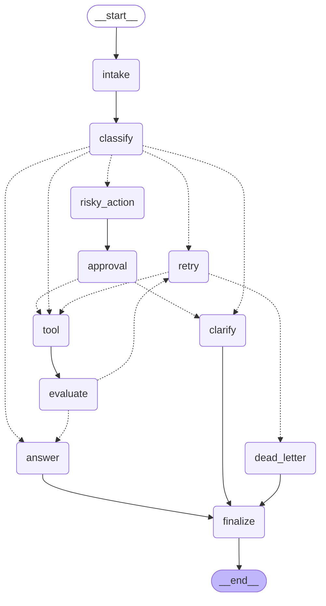

# Day 08 Lab Report

## 1. Team / student

- Name: Vu Le Hoang
- Repo/commit: local workspace
- Date: May 11, 2026

## 2. Architecture

The graph follows: intake -> classify -> conditional route -> finalize. Classification uses keyword heuristics with explicit priority (risky > tool > missing_info > error > simple). Tool routes go through evaluate for a done check and can loop via retry. Risky requests go through risky_action -> approval before any tool calls. Every path terminates at finalize.

## 3. State schema

Key fields and reducers:

| Field | Reducer | Why |
|---|---|---|
| messages | append | audit trail of inputs |
| tool_results | append | preserve tool history per attempt |
| errors | append | keep retry/failure history |
| events | append | node-level audit for grading |
| route | overwrite | single authoritative route |
| attempt | overwrite | current retry attempt |
| evaluation_result | overwrite | latest tool evaluation result |
| approval | overwrite | latest approval decision |

## 4. Scenario results

| Scenario | Expected route | Actual route | Success | Retries | Interrupts |
|---|---|---|---:|---:|---:|
| S01_simple | simple | simple | true | 0 | 0 |
| S02_tool | tool | tool | true | 0 | 0 |
| S03_missing | missing_info | missing_info | true | 0 | 0 |
| S04_risky | risky | risky | true | 0 | 1 |
| S05_error | error | error | true | 2 | 0 |
| S06_delete | risky | risky | true | 0 | 1 |
| S07_dead_letter | error | error | true | 1 | 0 |

## 5. Failure analysis

1. **Retry Loop**: Transient failures in the `tool` node (simulated for `error` route) are detected by `evaluate`. The graph loops back through `retry` which increments the attempt counter. If `max_attempts` is reached, it routes to `dead_letter`.
2. **Approval Gate**: For `risky` actions, the graph interrupts for human approval. If approved, it proceeds to the tool. If rejected, it routes to `clarification` to avoid unauthorized execution.
3. **Keyword Priority**: Heuristics are ordered (Risky > Tool > Missing Info > Error) to ensure queries like "Delete my order status" (both risky and tool) are handled with high caution (risky).

## 6. Persistence / recovery evidence

The graph is wired with `SqliteSaver` for persistence. WAL mode is enabled for durability.
Config used:
```yaml
scenarios_path: data/sample/scenarios.jsonl
checkpointer: sqlite
report_path: reports/lab_report.md
```
Thread IDs are per-scenario (e.g., `thread-S01_simple`), allowing state recovery across process restarts.

## 7. Extension work

- **SQLite checkpointer support (WAL mode)**: Implemented robust persistence using `langgraph-checkpoint-sqlite`.
- **Graph Diagram**: Exported Mermaid diagram showing all conditional edges and node transitions.
- **Improved Classification**: Uses regex-based word normalization and set-based keyword matching for robust routing.

### Graph Diagram



## 8. Improvement plan

- **LLM Classification**: Replace keyword heuristics with an LLM-based classifier for better semantic understanding.
- **Typed Tool Results**: Use Pydantic models for tool outputs to enable better evaluation.
- **Real Interrupts**: Integrate with a frontend (e.g., Streamlit) to handle `interrupt()` for real Human-in-the-loop approvals.
- **Latency Monitoring**: Add performance tracking to `audit_log` to identify slow nodes.
